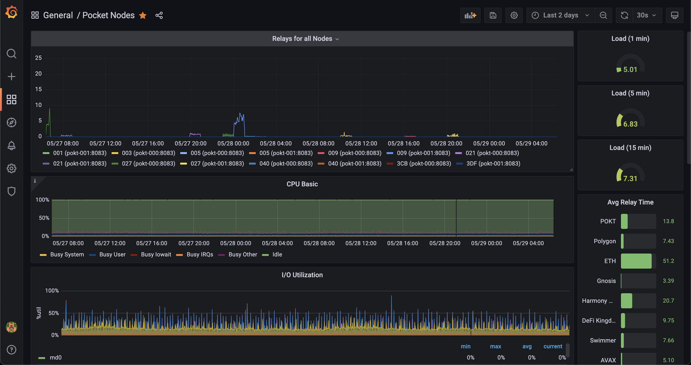

# Real Time Dashboard for Monitoring Pocket Nodes

This directory contains a docker stack that can be used to provision a solution for monitoring pocket nodes' 
session participation, alongside basic system metrics (CPU, Load Avg, I/O Utilization, etc).

This setup is by no means exhaustive.  It is meant to serve as a reference / jumping-off point for those who would like
to gain deeper insight into their nodes' performance, and to have the ability to monitor the servicing of relays in 
real-time.



## Overview

The enclosed *docker-compose.yml* defines the following containers:
- prometheus (port 9090)
- node_exporter (port 9100)
- grafana (port 3003)

## How to use

The Grafana web UI will be exposed on your host's port 3003.  It is recommended that you use your firewall to limit 
access to this port to trusted IPs only. 

1. Check out the repository on the server you would like to monitor:
   ```bash
   git clone https://github.com/itsnoproblem/pokt-tools
   ```
2. Navigate to the node-monitoring directory and modify *docker-compose.yml* 
   - you can set the grafana admin password (only applies the first time you start the containers, after this you will need to use the grafana UI to change it) 
     ```
     GF_SECURITY_ADMIN_PASSWORD=YOURADMINPASSWORD 
     ```
   - under the *prometheus* service, set the `PROMETHEUS_TARGETS` environment variable to refer to your nodes' metrics 
     export endpoint(s)
     ```
     PROMETHEUS_TARGETS: "'pokt-000:8083','pokt-001:8083'" 
     ``` 
3. Start the containers: 
   ```
   docker-compose up -d 
   ```
   Now you can visit your grafana instance at http://yournodeurl:3003 
